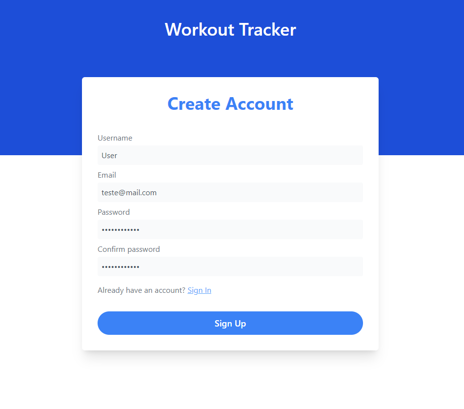
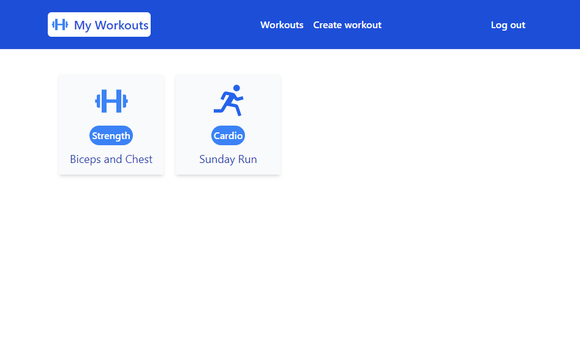
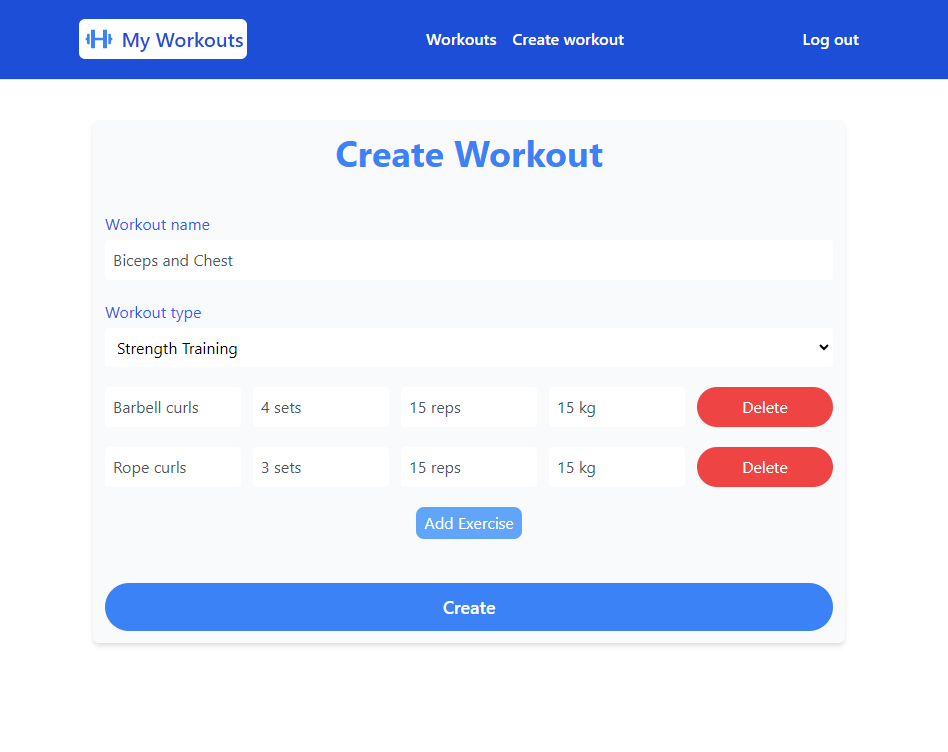
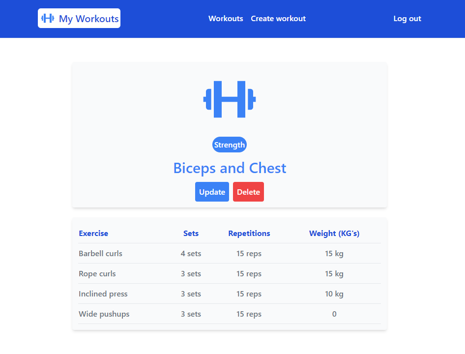

<h1 align="center" style="padding: 2rem">🏋️‍♂️ Workout Tracker</h1>

<p align="center" style="margin-top: 1rem">
    
    
    
    
</p>

Workout Tracker é um web app para organização de treinos. A aplicação foi desenvolvida com python, django, html e tailwind, e contém um sistema de autenticação.

## 🔧 Instalação

Instalação das dependências necessárias para rodar a aplicação, contidas no arquivo <strong>requirements.txt</strong>:

```bash
  pip3 install -r requirements.txt
```

Criando migrações do banco de dados:

```bash
  python manage.py makemigrations
  python manage.py migrate
```

Rodar a aplicação localmente:

```bash
  python manage.py runserver
```

Acesse a aplicação pelos endereços: http://localhost:8000 ou http://127.0.0.1:8000/


## 📷 Screenshots

<p align="center">
  
  
  
  
</p>

## 📄 Licença

Este projeto está sob a licença MIT - veja o arquivo [LICENSE](https://github.com/Gustavo-Sales/workout-tracker-django/blob/main/LICENSE) para detalhes.